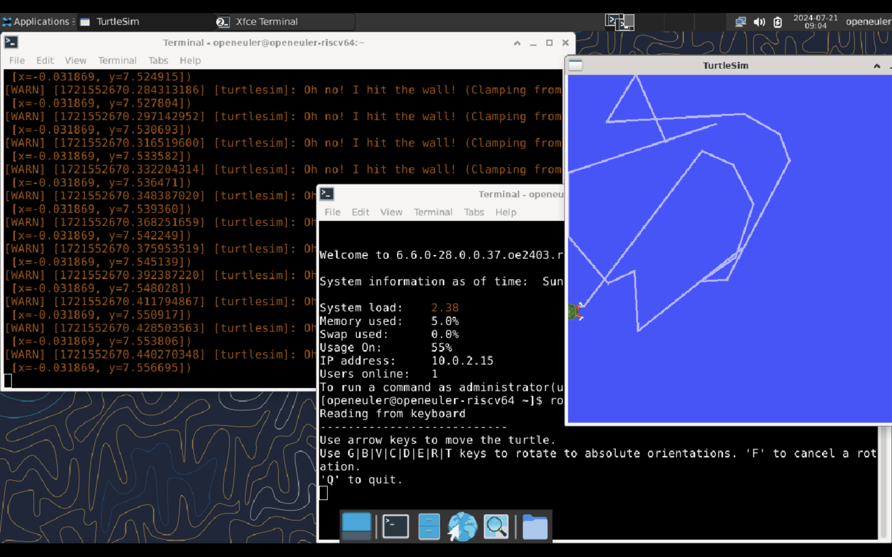

# 在 openEuler 测试 ROS 小乌龟程序-riscv64

## 软硬件信息

### MacBook

硬件：MacBook Air M1
内存：8G
系统：macOS 15.0（beta）

### 虚拟机

QEMU 版本：9.0.2

### openEuler

版本：openEuler-24.03-LTS 20240720 v0.1

### 开始之前

- 确保你的 QEMU 是从源码编译的，并不是从 brew 上直接安装的
- 镜像等文件链接：https://mirror.iscas.ac.cn/openeuler-sig-riscv/openEuler-RISC-V/devel/20240720/v0.1/QEMU/

## 一、仿真 openEuler riscv64 环境

### 从源码编译 QEMU

```
## 安装所需依赖
brew install pkg-config glib gnutls pixman sphinx-doc meson ninja libdwarf wget
## 下载源码
wget https://download.qemu.org/qemu-9.0.2.tar.xz
tar -xvf qemu-9.0.2.tar.xz
cd qemu-9.0.2
## 配置并编译
./configure --target-list=riscv64-softmmu --enable-sdl --enable-slirp 
make -j8
make install
```

完成编译之后，使用以下代码测试是否正确安装 qemu：
```
yuyu@MacBookAir ~ % qemu-system-riscv64 --version
QEMU emulator version 9.0.2
Copyright (c) 2003-2024 Fabrice Bellard and the QEMU Project developers
```

### 下载 openEuler 镜像等文件

需要下载的文件如下：
- [fw_payload_oe_uboot_2304.bin](https://mirror.iscas.ac.cn/openeuler-sig-riscv/openEuler-RISC-V/devel/20240720/v0.1/QEMU/fw_payload_oe_uboot_2304.bin)
- [openEuler-24.03-V1-xfce-qemu-devel.qcow2.zst](https://mirror.iscas.ac.cn/openeuler-sig-riscv/openEuler-RISC-V/devel/20240720/v0.1/QEMU/openEuler-24.03-V1-xfce-qemu-devel.qcow2.zst)
- [start_vm_xfce.sh](https://mirror.iscas.ac.cn/openeuler-sig-riscv/openEuler-RISC-V/devel/20240720/v0.1/QEMU/start_vm_xfce.sh)

请将他们放在同一个文件夹，并且解压镜像，步骤如下，同时这里以 oe24 文件夹作为示例：

```
yuyu@MacBookAir oe24 % zstd -d openEuler-24.03-V1-xfce-qemu-devel.qcow2.zst
yuyu@MacBookAir oe24 % tree
.
├── fw_payload_oe_uboot_2304.bin
├── openEuler-24.03-V1-xfce-qemu-devel.qcow2
├── openEuler-24.03-V1-xfce-qemu-devel.qcow2.zst
└── start_vm_xfce.sh

1 directory, 4 files
```
### 扩容镜像

由于默认镜像的存储空间不足以安装所有的 ros 的软件包，所以需要对镜像进行扩容。

```
qemu-img resize openEuler-24.03-V1-xfce-qemu-devel.qcow2 50G
```

调整完镜像大小后使用脚本启动虚拟机，步骤如下：

```
chmod +x start_vm_xfce.sh
./start_vm_xfce.sh
```

启动虚拟机后，使用如下账号密码进行登录：
```
openeuler
openEuler12#$
```
调整刚才扩容的分区：
```
sudo fdisk /dev/vda

## 调整分区

Command (m for help): p
Command (m for help): d
Partition number (1,2, default 2): 2
Command (m for help): n
Select (default p): p
Partition number (default 2): 2
First sector (1050624, default 1050624): 1050624
Last sector, +/-sectors or +/-size{K,M,G,T,P} (1050624-104857566, default 104857566): [按回车使用默认值以使用所有可用空间]
Do you want to remove the signature? [Y]es/[N]o: N
Command (m for help): w

## 保存后重启

sudo init 6
```
重启后查看虚拟机存储：
```
[root@openeuler-riscv64 ~]# df -h
Filesystem      Size  Used Avail Use% Mounted on
/dev/root        49G  2.9G   44G   7% /
devtmpfs        3.9G     0  3.9G   0% /dev
tmpfs           3.9G     0  3.9G   0% /dev/shm
tmpfs           1.6G  520K  1.6G   1% /run
tmpfs           4.0M     0  4.0M   0% /sys/fs/cgroup
tmpfs           3.9G  4.0K  3.9G   1% /tmp
/dev/vda1       504M  309M  170M  65% /boot
tmpfs           793M  8.0K  793M   1% /run/user/995
tmpfs           793M  4.0K  793M   1% /run/user/0
```
分区大小调整成功，虚拟机启动成功。

## 二、开始测试小乌龟程序

### 依赖安装

执行了如下指令更换源：
```
## 更换源
bash -c 'cat << EOF > /etc/yum.repos.d/ROS.repo
[openEulerROS-humble]
name=openEulerROS-humble
baseurl=https://build-repo.tarsier-infra.isrc.ac.cn/openEuler:/ROS/24.03/
enabled=1
gpgcheck=0
EOF'
## 更新源
sudo dnf update
```
更新成功后，开始下载 ros 软件包，为避免软件包冲突问题，需要分两次下载包，指令如下：

```
sudo dnf install "ros-humble-*" 
sudo dnf install "ros-humble-*" --exclude=ros-humble-admittance-controller --exclude=ros-humble-generate-parameter-library-example --skip-broken 
```
所有包安装成功之后，编辑 ~/.bashrc 添加以下内容：
```
source /opt/ros/humble/setup.sh
```
随后输入以下指令激活：
```
source ~/.bashrc
```
### 开始测试

在桌面环境下分别打开两个终端窗口：

在第一个窗口中输入：
```
ros2 run turtlesim turtlesim_node
```

待第一个窗口成功加载 TurtleSim 窗口后，在第二个窗口中输入：
```
ros2 run turtlesim turtle_teleop_key
```
选中第二个窗口，使用方向键控制小乌龟移动。


### 预期行为

小乌龟正常移动。

### 实际行为

如下图所示，乌龟正常移动。



## 其他说明

关于包冲突的问题，可以参考该[文档](https://github.com/Jiawei-afk/PLCT/blob/main/report/2024.7/week1/openEuler-ROS2-Humble-install.md)获得更详细的信息。