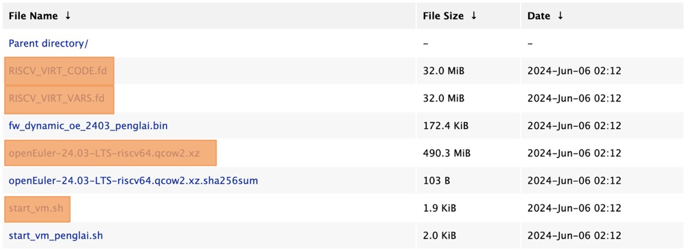

# 一、仿真 openEuler riscv64 环境
## 简介
本文将介绍如何在 macOS 上安装 openeuler 虚拟机仿真 riscv64 环境并且测试 ROS 小乌龟程序。

## 软硬件信息

### MacBook

硬件：MacBook Air M1
内存：8G
系统：macOS 15.0（beta）

### 虚拟机

QEMU 版本：9.0.2

### openEuler

版本：openEuler-24.03-LTS

## 前置依赖

首先确保 macOS 上的 brew 包管理器能够正常的使用，再通过 brew 安装 QEMU。

```log
yuiyuuhayashi@MacBook-Air-2 ~ % brew -v
Homebrew 4.3.9
yuiyuuhayashi@MacBook-Air-2 ~ % brew install qemu
==> Downloading https://formulae.brew.sh/api/formula.jws.json
-=O=#    #       #         #
==> Downloading https://formulae.brew.sh/api/cask.jws.json
##################################################################################################################################################################################################### 100.0%
Warning: qemu 9.0.2 is already installed and up-to-date.
To reinstall 9.0.2, run:
  brew reinstall qemu
yuiyuuhayashi@MacBook-Air-2 ~ % qemu-system-riscv64 --version
QEMU emulator version 9.0.2
Copyright (c) 2003-2024 Fabrice Bellard and the QEMU Project developers
```

通过以上 log 我们可以确定我们所需的前置依赖都已经安装完毕

## 镜像下载

下载请点击[这里](https://repo.openeuler.org/openEuler-24.03-LTS/virtual_machine_img/riscv64/)


进入镜像站后，将图中标注橙色的部分下载下来，并且将他们放进同一个文件夹中。
下载完成之后，将 openEuler-24.03-LTS-riscv64.qcow2.xz 使用 `xz -d openEuler-24.03-LTS-riscv64.qcow2.xz` 指令进行解压。

这里以 oe24 作为示例。

```log
yuiyuuhayashi@MacBook-Air-2 ~ % tree oe24
oe24
├── RISCV_VIRT_CODE.fd
├── RISCV_VIRT_VARS.fd
├── openEuler-24.03-LTS-riscv64.qcow2
└── start_vm.sh

1 directory, 4 files
```

## 启动虚拟机

首先，将文件夹中的 start_vm.sh 脚本进行赋权：
```
chmod +x start_vm.sh
```

接着，启动虚拟机：
```
yuiyuuhayashi@MacBook-Air-2 oe24 % ./start_vm.sh
:: Starting VM...
:: Using following configuration

vCPU Cores: 8
Memory: 8G
Disk: openEuler-24.03-LTS-riscv64.qcow2
SSH Port: 12055

:: NOTE: Make sure ONLY ONE .qcow2 file is
in the current directory

:: NOTE: Only QEMU 8.1+ compiled with '--enable-slirp' is supported.

:: Tip: Try setting DNS manually if QEMU user network doesn't work well.
:: HOWTO -> https://serverfault.com/a/810639

:: Tip: If 'ping' reports permission error, try reinstalling 'iputils'.
:: HOWTO -> 'sudo dnf reinstall iputils'


OpenSBI v1.4
   ____                    _____ ____ _____
  / __ \                  / ____|  _ \_   _|
 | |  | |_ __   ___ _ __ | (___ | |_) || |
 | |  | | '_ \ / _ \ '_ \ \___ \|  _ < | |
 | |__| | |_) |  __/ | | |____) | |_) || |_
  \____/| .__/ \___|_| |_|_____/|____/_____|
        | |
        |_|

Platform Name             : riscv-virtio,qemu
Platform Features         : medeleg
Platform HART Count       : 8
Platform IPI Device       : aclint-mswi
Platform Timer Device     : aclint-mtimer @ 10000000Hz
Platform Console Device   : uart8250
Platform HSM Device       : ---
Platform PMU Device       : ---
Platform Reboot Device    : syscon-reboot
Platform Shutdown Device  : syscon-poweroff
Platform Suspend Device   : ---
Platform CPPC Device      : ---
Firmware Base             : 0x80000000
Firmware Size             : 395 KB
Firmware RW Offset        : 0x40000
Firmware RW Size          : 139 KB

```


进入系统后，安装 neofetch：
```
[root@localhost ~]# dnf install wget
OS                                               19 kB/s | 3.5 kB     00:00
everything                                       16 kB/s | 3.5 kB     00:00
EPOL                                             18 kB/s | 3.0 kB     00:00
debuginfo                                        18 kB/s | 3.5 kB     00:00
source                                           18 kB/s | 3.5 kB     00:00
update                                           18 kB/s | 3.0 kB     00:00
update-source                                    20 kB/s | 3.5 kB     00:00
Dependencies resolved.
================================================================================
 Package             Architecture    Version                   Repository  Size
================================================================================
Installing:
 wget                riscv64         1.21.4-1.oe2403           OS         668 k
Installing dependencies:
 libmetalink         riscv64         0.1.3-12.oe2403           OS          25 k

Transaction Summary
================================================================================
Install  2 Packages

Total download size: 694 k
Installed size: 3.2 M
Is this ok [y/N]: y
Downloading Packages:
(1/2): libmetalink-0.1.3-12.oe2403.riscv64.rpm   97 kB/s |  25 kB     00:00
(2/2): wget-1.21.4-1.oe2403.riscv64.rpm         1.2 MB/s | 668 kB     00:00
--------------------------------------------------------------------------------
Total                                           1.2 MB/s | 694 kB     00:00
Running transaction check
Transaction check succeeded.
Running transaction test
Transaction test succeeded.
Running transaction
  Preparing        :                                                        1/1
  Installing       : libmetalink-0.1.3-12.oe2403.riscv64                    1/2
  Installing       : wget-1.21.4-1.oe2403.riscv64                           2/2
  Running scriptlet: wget-1.21.4-1.oe2403.riscv64                           2/2
  Verifying        : libmetalink-0.1.3-12.oe2403.riscv64                    1/2
  Verifying        : wget-1.21.4-1.oe2403.riscv64                           2/2

Installed:
  libmetalink-0.1.3-12.oe2403.riscv64        wget-1.21.4-1.oe2403.riscv64

Complete!
[root@localhost ~]# wget https://github.com/dylanaraps/neofetch/archive/refs/tags/7.1.0.tar.gz
--2024-04-20 14:25:17--  https://github.com/dylanaraps/neofetch/archive/refs/tags/7.1.0.tar.gz
Resolving github.com (github.com)... 20.205.243.166
Connecting to github.com (github.com)|20.205.243.166|:443... connected.
HTTP request sent, awaiting response... 302 Found
Location: https://codeload.github.com/dylanaraps/neofetch/tar.gz/refs/tags/7.1.0 [following]
--2024-04-20 14:25:18--  https://codeload.github.com/dylanaraps/neofetch/tar.gz/refs/tags/7.1.0
Resolving codeload.github.com (codeload.github.com)... 20.205.243.165
Connecting to codeload.github.com (codeload.github.com)|20.205.243.165|:443... connected.
HTTP request sent, awaiting response... 200 OK
Length: unspecified [application/x-gzip]
Saving to: ‘7.1.0.tar.gz’

7.1.0.tar.gz            [ <=>                ]  93.16K   580KB/s    in 0.2s

2024-04-20 14:25:19 (580 KB/s) - ‘7.1.0.tar.gz’ saved [95400]

[root@localhost ~]# tar -xvf 7.1.0.tar.gz
neofetch-7.1.0/
neofetch-7.1.0/.github/
neofetch-7.1.0/.github/ISSUE_TEMPLATE.md
neofetch-7.1.0/.github/PULL_REQUEST_TEMPLATE.md
neofetch-7.1.0/.travis.yml
neofetch-7.1.0/CONTRIBUTING.md
neofetch-7.1.0/LICENSE.md
neofetch-7.1.0/Makefile
neofetch-7.1.0/README.md
neofetch-7.1.0/neofetch
neofetch-7.1.0/neofetch.1
[root@localhost ~]# cd neofetch-7.1.0/
```

使用 neofetch 输出系统信息：
```log
[root@localhost neofetch-7.1.0]# ./neofetch
                                                         root@localhost
                       (#####                            --------------
                     (((########  #####                  OS: openEuler 24.03 (LTS) riscv64
                    (((        ##########    __...__     Host: riscv-virtio,qemu
             ((((((((           #######    /((((((###\   Kernel: 6.6.0-27.0.0.31.oe2403.riscv64
           (((((((((((   .......           \(((((####/   Uptime: 2 mins
          ((((((    ((((#########            *******     Packages: 1192 (rpm)
    %((((((#          ((########                         Shell: bash 5.2.15
 /////(((((              ###                             Terminal: /dev/ttyS0
/////(((((((#   (((&                                     CPU: (8)
         (((((((((((((                                   GPU: 00:01.0 Virtio: Virtio 1.0 GPU
          ((((((((((((                                   Memory: 223MiB / 7678MiB
           (((((((((     ((((((###
                       /((((((######
                      //((((((######
                       /((((((#####
                        *********/
```

**系统已经成功安装！**
### 其他说明

默认账号密码：
```
root
openEuler12#$
```

如需调整虚拟机各项参数，请调整 start_vm.sh  脚本。

# 二、测试 ROS 小乌龟程序

进入系统后，首先执行以下指令更换源：

```log
bash -c 'cat << EOF > /etc/yum.repos.d/ROS.repo
[openEulerROS-humble]
name=openEulerROS-humble
baseurl=https://build-repo.tarsier-infra.isrc.ac.cn/openEuler:/ROS/24.03/
enabled=1
gpgcheck=0
EOF'
```

更换成功后，开始下载 ros-humble 的所有的包，指令如下：

```
dnf install "ros-humble-*" --skip-broken --exclude=ros-humble-generate-parameter-library-example
```


Running transaction check
Transaction check succeeded.
Running transaction test
The downloaded packages were saved in cache until the next successful transaction.
You can remove cached packages by executing 'dnf clean packages'.
Error: Transaction test error:
  file /opt/ros/humble/include/admittance_controller_parameters/admittance_controller_parameters.hpp conflicts between attempted installs of ros-humble-generate-parameter-library-example-0.3.3-1.oe2403.riscv64 and ros-humble-admittance-controller-2.17.3-1.oe2403.riscv64

安装完成后，开始安装图形化界面，执行指令如下：
```
dnf install ukui
```


### 其他说明

- 在安装 ukui 图形化界面时若中断，重新执行一次 `dnf install ukui` 即可。

```
(220-224/784): Packa 24% [====-               ] 185 kB/s | 385 MB    108:08 ETA
The downloaded packages were saved in cache until the next successful transaction.
You can remove cached packages by executing 'dnf clean packages'.
Error: Error downloading packages:
  LibRaw-0.21.1-2.oe2403.riscv64: Cannot download, all mirrors were already tried without success
[root@localhost ~]# dnf install ukui
```

